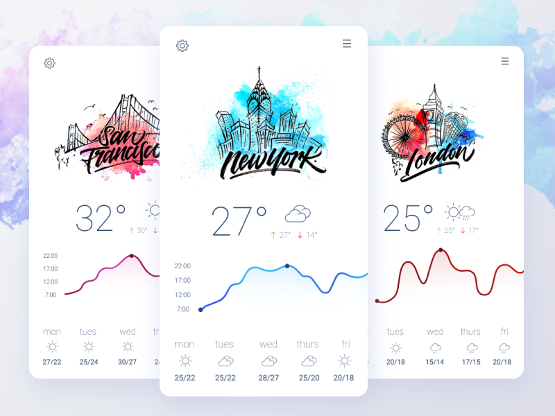

# Weathrly
## A weather app created with Weather Underground API and React.

Project requirements can be found [here](http://frontend.turing.io/projects/weathrly.html).

### Inspiration

### Wireframes

### App Screenshot
